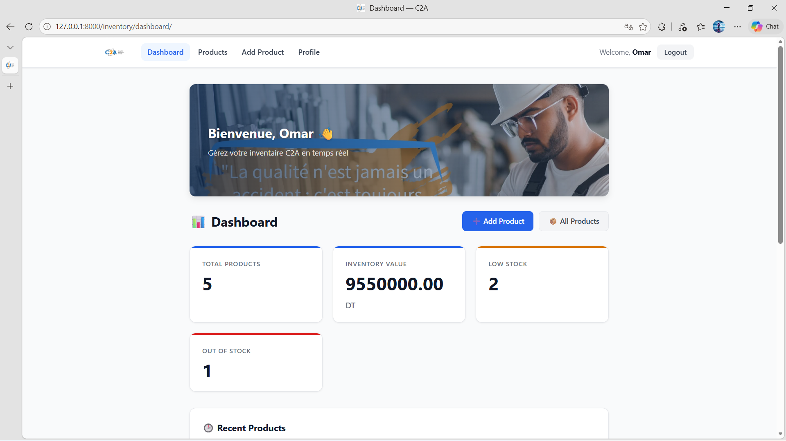
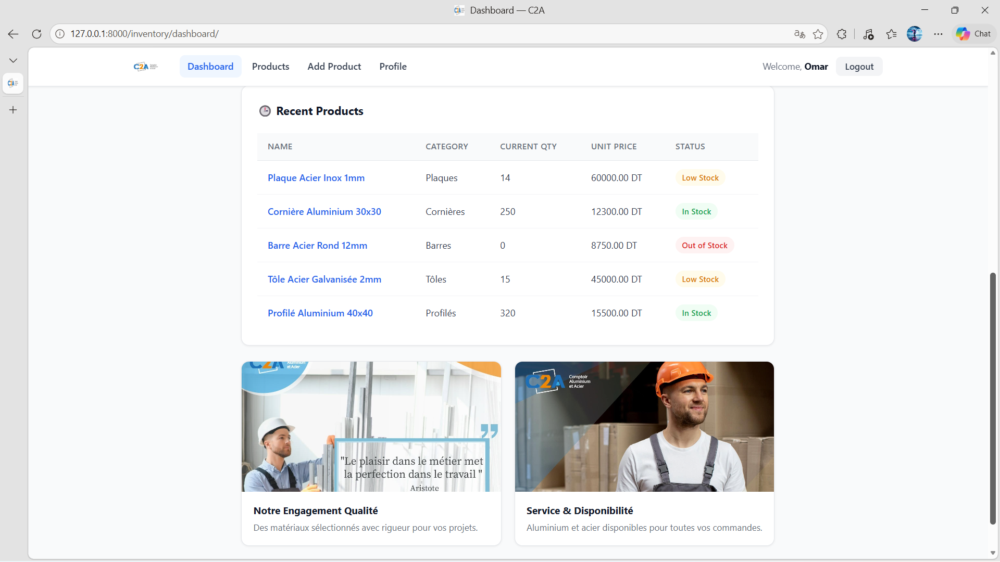
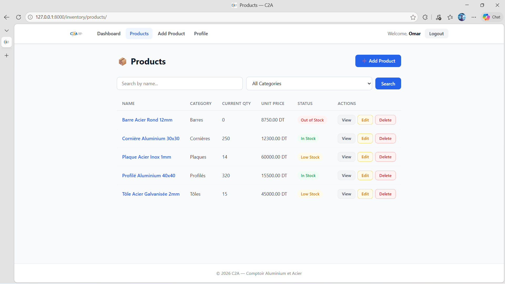
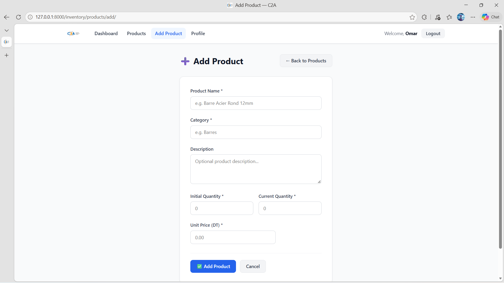
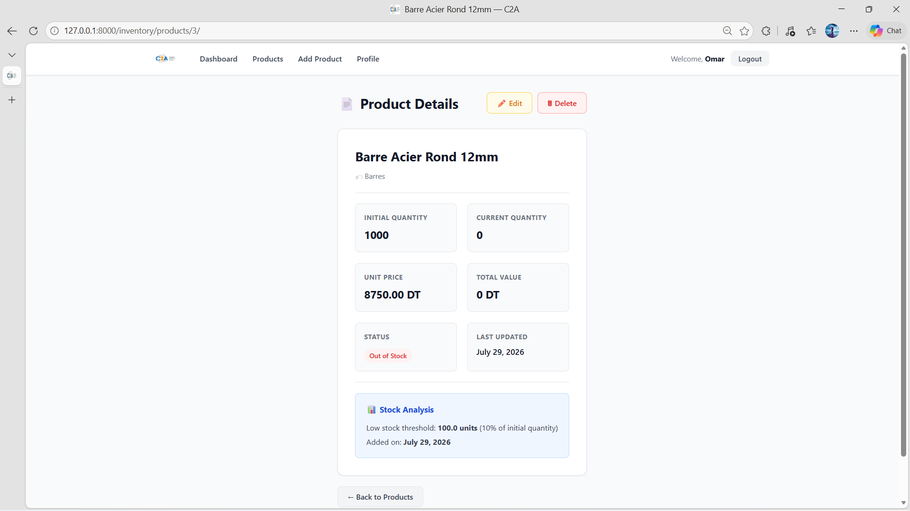

# C2A Stock Management System

A web-based stock management application developed with Django and Python during a technical internship at **Comptoir Aluminium et Acier (C2A)**.

The application provides a complete workflow for managing products and stock, including product creation, modification, deletion, search, filtering, stock monitoring, and dashboard statistics.

## 📸 Screenshots

### Dashboard



### Dashboard - Stock Overview



### Product List



### Add Product



### Product Details



## 🎯 Project Overview

This project was developed as part of a technical internship at **Comptoir Aluminium et Acier (C2A)** in Gabès from **July 1 to July 31, 2026**.

The main objective was to design and develop a web-based stock management system that allows users to efficiently manage product inventory and monitor stock information.

The application combines a Django/Python backend with an HTML5, CSS3, and JavaScript frontend.

## ✨ Features

- User registration and authentication
- Login and logout
- User profile
- Product management
- Add products
- View product details
- Edit products
- Delete products
- Product search
- Product filtering
- Stock quantity management
- Stock status monitoring
- Dashboard with key statistics
- Form validation
- Access control
- Django administration

## 🛠️ Technologies

- **Python**
- **Django**
- **HTML5**
- **CSS3**
- **JavaScript**
- **SQLite**

## 🏗️ Architecture

The application follows Django's **MVT (Model-View-Template)** architecture.

The project is organized into separate applications for authentication and inventory management.

```text
c2a-stock-management-django/
│
├── accounts/                  # User authentication and profiles
│   ├── forms.py
│   ├── models.py
│   ├── urls.py
│   ├── views.py
│   └── templates/
│
├── inventory/                 # Stock and product management
│   ├── forms.py
│   ├── models.py
│   ├── urls.py
│   ├── views.py
│   └── templates/
│
├── stock_management/          # Project configuration
│   ├── settings.py
│   ├── urls.py
│   ├── asgi.py
│   └── wsgi.py
│
├── templates/                 # Shared templates
│   └── base.html
│
├── static/                    # CSS, JavaScript and images
│   ├── css/
│   ├── js/
│   └── images/
│
├── manage.py                  # Django management script
├── requirements.txt           # Python dependencies
└── .gitignore                 # Git ignored files